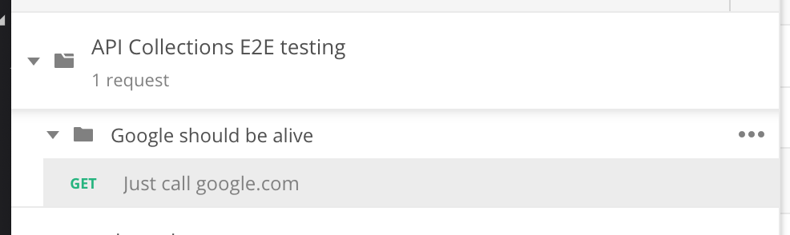
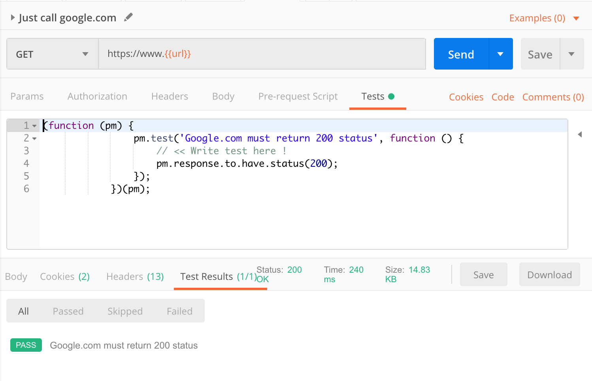
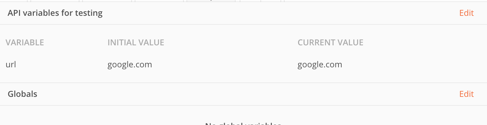

# Starman

Let the children lose it 🧒🏼

Let the children use it 🧒🏻

Let all the children boogie 🧒🏽

Star(com)man(d) is "newman" with steriod 💪🏼

Starman let you do Postman collection with the way the developer love it !! ✨🌟⭐️ 🚀🍾🧚🏼‍♀️💫

## Considered this example before you decide to use it
1. Prepare your test senario with Postman test API
```js
// test-runner.js
Starman(
  [
    runner => {
      runner('Google should be alive', [ // << This is folder name
        new StarmanRequestStep('Just call google.com') // << This is request name
          .Get('https://www.{{url}}')
          .AddTest(pm => {
            pm.test("Google.com must return 200 status", () => { // << Write test here !
              pm.response.to.have.status(200)
            })
          })
      ])
    }
  ],
  {
    url: 'google.com'
  },
  {
    outputDir: join(__dirname, './basic-collections'),
    collectionName: "Google handshake collections"
  }
)
```
2. Run this file and you will get the result from "newman"
```
API Collections E2E testing

❏ Google should be alive
↳ Just call google.com
  GET https://www.google.com [200 OK, 14.8KB, 317ms]
  ✓  Google.com must return 200 status

┌─────────────────────────┬────────────────────┬───────────────────┐
│                         │           executed │            failed │
├─────────────────────────┼────────────────────┼───────────────────┤
│              iterations │                  1 │                 0 │
├─────────────────────────┼────────────────────┼───────────────────┤
│                requests │                  1 │                 0 │
├─────────────────────────┼────────────────────┼───────────────────┤
│            test-scripts │                  1 │                 0 │
├─────────────────────────┼────────────────────┼───────────────────┤
│      prerequest-scripts │                  0 │                 0 │
├─────────────────────────┼────────────────────┼───────────────────┤
│              assertions │                  1 │                 0 │
├─────────────────────────┴────────────────────┴───────────────────┤
│ total run duration: 447ms                                        │
├──────────────────────────────────────────────────────────────────┤
│ total data received: 14.06KB (approx)                            │
├──────────────────────────────────────────────────────────────────┤
│ average response time: 317ms [min: 317ms, max: 317ms, s.d.: 0ns] │
└──────────────────────────────────────────────────────────────────┘
```

3. Enjoy Postman collection after test success 





## Installation

> NPM package already has starman package so I should use another package name to publish it 😫

```
$ npm i starman-js
```

## Usage

See basic usage in `/test/basic.test.ts`
